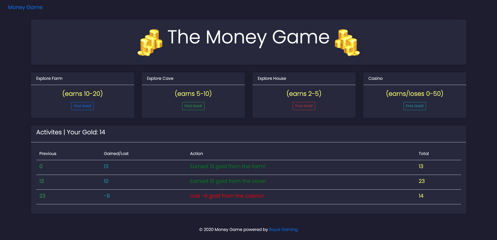

# :computer: Money Game
Money Game is a webpage that allows a user to play a gold finding game. Depending on the action the user decides to make, the user can gain a random amount of gold or lose gold if and only if they choose the casino. The amount that the user gains or loses is displayed at the bottom of the page alongside a description of the action made and the current amount of gold the user has. The results are displayed using Django partials and AJAX; javascript listens for a submit request from one of the buttons, then an ajax call is made to the route that handles the buttons data and then a response is shown using a partial.

# :pencil2: What I learned  
  * Django structure
  * Partials
  * AJAX

# :camera: Screenshots

